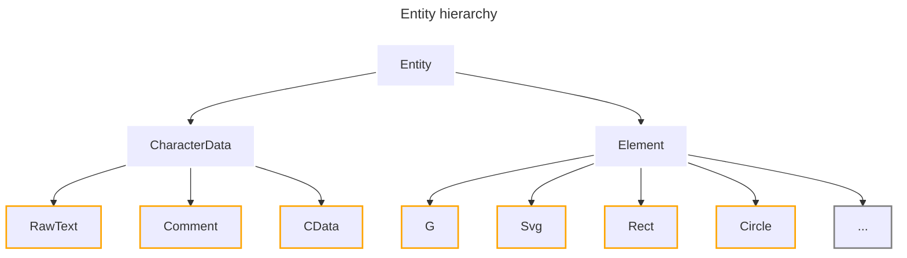

<a id="readme-top"></a>


[](https://pypi.org/project/svglab/)


[](https://libraries.io/pypi/svglab/tree)
[](https://codecov.io/github/reznakt/svglab)


<br />
<div align="center">
  

  <h3 align="center">svglab</h3>

  <p align="center">
    <em>A manipulation and optimization library for Scalable Vector Graphics</em>
  </p>
</div>
<hr />

### Table of Contents

<ul>
  <li>
    <a href="#about-the-project">About The Project</a>
  </li>
  <li>
    <a href="#getting-started">Getting Started</a>
    <ul>
      <li><a href="#prerequisites">Prerequisites</a></li>
      <li><a href="#installation">Installation</a></li>
    </ul>
  </li>
  <li><a href="#usage">Usage</a></li>
  <li>
    <a href="#development">Development</a>
    <ul>
      <li><a href="#setup">Setup</a></li>
      <li><a href="#common-tasks">Common tasks</a></li>
    </ul>
  </li>
  <li><a href="#license">License</a></li>
</ul>

## About The Project

### Features

- SVG parsing, manipulation, and writing
- Support for all SVG 1.1 elements and attributes
- Partial support for SVG 2
- Support for special XML entities (`CDATA`, comments, text)
- Attributes are parsed into native Python types for easy manipulation
- Highly configurable formatting options:
  - indentation level
  - maximum precision for floating-point numbers
  - color mode (`rgb`, `rgba`, `hsl`, `hex`, `named`)
  - relative/absolute path commands
  - scientific notation for small/large numbers
  - and many more...
- Strong type safety:
  - one class per distinct SVG element
  - typed attributes
  - runtime validation thanks to [pydantic](https://pypi.org/project/pydantic/)
- Support for all [beautifulsoup4](https://pypi.org/project/beautifulsoup4/) parsers (e.g., `html.parser`, `lxml`, `html5lib`)
- SVG can be rendered into a raster image using [resvg](https://lib.rs/crates/resvg)
- Support for calculating the bounding box and mask of an element
- Support for applying transformations in the `transform` attribute ("reification")



<p align="right">(<a href="#readme-top">back to top</a>)</p>

## Getting Started

### Prerequisites

- [CPython](https://www.python.org/) $\geq$ 3.10
- [Poetry](https://python-poetry.org/) $\geq$ 2.0 (development only)

### Installation

**From PyPi**:

```sh
pip install svglab
```

**From source**:

```sh
# Via HTTPS
pip install git+https://github.com/reznakt/svglab.git

# Via SSH
pip install git+ssh://git@github.com/reznakt/svglab.git
```

<p align="right">(<a href="#readme-top">back to top</a>)</p>

## Usage

```python
# Parse an existing SVG file
svg = parse_svg(
    """
    <svg xmlns="http://www.w3.org/2000/svg" width="100" height="100">
      <g>
          <rect
            id="background"
            width="100cm"
            height="100%"
            transform="rotate(45)"
            stroke="red"
          />
          <rect color="hsl(0, 100%, 100%)"/>
          <!-- This is a comment -->
          <![CDATA[.background { fill: blue; }]]>
          Hello SVG!
          <path d="M 10,10 H 10 L 100,100 Q 100,100 50,50 v 100 Z"/>
          <path d="M0,0 10,10 20,20 S 100,100 50,50 t 100,100 M 50,50 z"/>
          <path d="M0,0A50,50 90 1 0 100,100v100h-10z"/>
          <polygon points="0,0 100,0 100,100 0,100"/>
      </g>
    </svg>
"""
)

print(svg)

# Create an element programmatically
group = G().add_children(
    Rect(
        width=Length(15, "px"),
        height=Length(20),
        transform=[SkewX(45.123), Translate(10, 20)],
        color=Color("#ff0000"),
    ),
    Comment("This is a comment"),
    CData(".background { fill: blue; }"),
    RawText("Hello SVG!"),
    Path(
        d=PathData()
        .move_to(Point(10, 10))
        .line_to(Point(100, 100))
        .quadratic_bezier_to(Point(100, 100), Point(50, 50))
        .smooth_quadratic_bezier_to(Point(100, 100))
        .move_to(Point(50, 50))
        .cubic_bezier_to(
            Point(100, 100), Point(100, 100), Point(10, 10)
        )
        .smooth_cubic_bezier_to(Point(100, 100), Point(50, 50))
        .arc_to(
            Point(50, 50), 90, Point(100, 100), large=True, sweep=False
        )
        .vertical_line_to(100)
        .horizontal_line_to(-10, relative=True)
        .close()
    ),
    Polyline(
        points=[
            Point(0, 0),
            Point(100, 0),
            Point(100, 100),
            Point(0, 100),
        ],
        stroke_linecap="square",
        opacity=0.5,
    ),
)

# Add the element to the SVG
svg.add_child(group)

# Manipulate attributes
print(svg.xmlns)  # http://www.w3.org/2000/svg
svg.x = Length(10, "px")

# Save to a file
svg.save(sys.stdout)

# Search the entity tree
print(*svg.find_all(Rect), sep="\n")
rect = svg.find(G).find(Rect)

# Compute the bounding box and mask of an element
print(rect.get_bbox())
print(rect.get_mask())

# Render the SVG to an image
image = svg.render()
print(image)

# Apply transformations in the transform attribute
svg.reify()
print(svg.to_xml())

# Change the view box
svg.set_viewbox((0, 0, 50, 50))
print(svg.to_xml())
```

<p align="right">(<a href="#readme-top">back to top</a>)</p>

## Development

### Setup

```sh
# Install dependencies
poetry install

# Activate the virtual environment
poetry shell

# Optional: Install pre-commit hooks
pre-commit install
```

### Common tasks

```sh
# Run tests
poe test

# Run type checker
poe typecheck

# Run linter
poe lint

# Fix linting errors
poe lint-fix

# Run formatter
poe format

# Fix formatting errors
poe format-fix
```

<p align="right">(<a href="#readme-top">back to top</a>)</p>

## License

This software is distributed under the MIT License. See [`LICENSE`](LICENSE) for more information.

<p align="right">(<a href="#readme-top">back to top</a>)</p>
