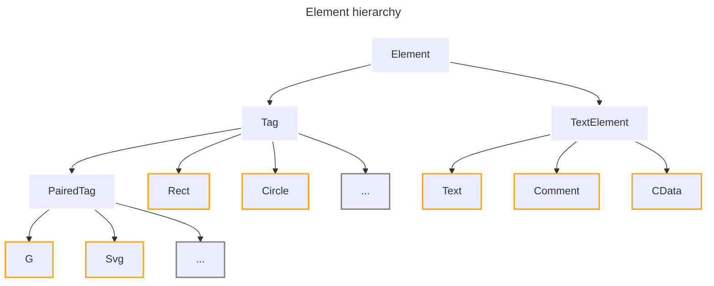

# svglab

A manipulation and optimization library for Scalable Vector Graphics (SVG).

## Features

- Strong type safety:
  - One class per distinct SVG element
  - Typed attributes
- Runtime validation thanks to [Pydantic](https://pypi.org/project/pydantic/)
- Attributes are parsed into native Python types for easy manipulation
- SVG parsing, manipulation, and writing
- Support for common SVG tags (`rect`, `g`, etc.)
- Support for special XML elements (`CDATA`, comments, text)
- Pretty printing with configurable indentation



## System Requirements

- [CPython](https://www.python.org/) $\geq$ 3.10
- [Poetry](https://python-poetry.org/) (development only)

## Installation

Currently, the library does not have a PyPI release. However, you can install it directly from the GitHub repository:

```sh
# Via HTTPS
pip install git+https://github.com/reznakt/svglab.git

# Via SSH
pip install git+ssh://github.com/reznakt/svglab.git
```

## Quick Start

```python
from svglab import CData, Comment, G, Rect, Text, parse_svg

# Parse an existing SVG file
svg = parse_svg(
    """
    <svg xmlns="http://www.w3.org/2000/svg">
        <g>
            <rect id="background" width="100" height="100"/>
            <!-- This is a comment -->
            <![CDATA[.background { fill: blue; }]]>
            Hello SVG!
        </g>
    </svg>
"""
)

# Create an element programmatically
group = G().add_children(
    Rect(),
    Comment("This is a comment"),
    CData(".background { fill: blue; }"),
    Text("Hello SVG!"),
)

# Add the element to the SVG
svg.add_child(group)

# Manipulate attributes
print(svg.xmlns)  # http://www.w3.org/2000/svg
svg.xmlns = "http://example.com"

# Save to a file
svg.save("example.svg", indent=4)
```

## Development

### Setup

```sh
# Install dependencies
poetry install

# Activate the virtual environment
poetry shell

# Optional: Install pre-commit hooks
pre-commit install
```

### Common tasks

```sh
# Run the CLI tool
poe start

# Run tests
poe test

# Run type checker
poe typecheck

# Run linter
poe lint

# Fix linting errors
poe lint-fix

# Run formatter
poe format

# Fix formatting errors
poe format-fix
```
