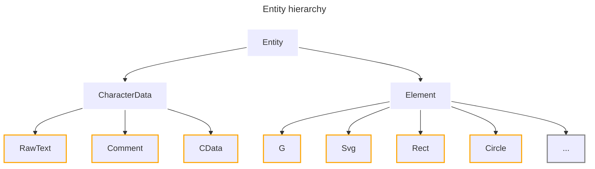

<a id="readme-top"></a>

[](https://pypi.org/project/svglab/)


[](https://libraries.io/pypi/svglab/tree)
[](https://codecov.io/github/reznakt/svglab)

<br />
<div align="center">
  

  <h3 align="center">svglab</h3>

  <p align="center">
    <em>A manipulation and optimization library for Scalable Vector Graphics</em>
  </p>
</div>
<hr />

### Table of Contents

<ul>
  <li>
    <a href="#about-the-project">About The Project</a>
  </li>
  <li>
    <a href="#getting-started">Getting Started</a>
    <ul>
      <li><a href="#prerequisites">Prerequisites</a></li>
      <li><a href="#installation">Installation</a></li>
    </ul>
  </li>
  <li><a href="#usage">Usage</a></li>
  <li>
    <a href="#development">Development</a>
    <ul>
      <li><a href="#setup">Setup</a></li>
      <li><a href="#common-tasks">Common tasks</a></li>
    </ul>
  </li>
  <li><a href="#license">License</a></li>
</ul>

## About The Project

### Features

- Full SVG 1.1 coverage &mdash; all 80 elements and 295 attributes
- Typed, validated attributes via [Pydantic](https://pypi.org/project/pydantic/)
- 20+ configurable formatting and optimization options
- Raster rendering via [resvg](https://lib.rs/crates/resvg)
- Bounding box and mask computation
- Transform reification (baking transforms into geometry)

See the [Overview](https://reznakt.github.io/svglab/overview/) for a detailed description of each capability.



<p align="right">(<a href="#readme-top">back to top</a>)</p>

## Getting Started

### Prerequisites

- [CPython](https://www.python.org/) $\geq$ 3.10
- [Poetry](https://python-poetry.org/) $\geq$ 2.0 (development only)

### Installation

```sh
pip install svglab
```

For alternative package managers (Poetry, uv) and installing from source, see the [Installation guide](https://reznakt.github.io/svglab/getting-started/installation/).

<p align="right">(<a href="#readme-top">back to top</a>)</p>

## Usage

```python
from svglab import parse_svg, Rect, Circle, Length, Color

# Parse an SVG
svg = parse_svg('<svg width="200" height="200"><circle cx="50" cy="50" r="40"/></svg>')

# Find and modify elements
circle = svg.find(Circle)
circle.fill = Color("red")

# Add new elements
svg.add_child(Rect(x=Length(10), y=Length(10), width=Length(30), height=Length(30)))

# Serialize
svg.save("output.svg")
```

For a complete walkthrough, see the [Quickstart](https://reznakt.github.io/svglab/getting-started/quickstart/).

<p align="right">(<a href="#readme-top">back to top</a>)</p>

## Development

### Setup

```sh
# Install dependencies
poetry install

# Activate the virtual environment
poetry shell

# Optional: Install pre-commit hooks
pre-commit install
```

### Common tasks

```sh
# Run tests
poe test

# Run type checker
poe typecheck

# Run linter
poe lint

# Fix linting errors
poe lint-fix

# Run formatter
poe format

# Fix formatting errors
poe format-fix
```

<p align="right">(<a href="#readme-top">back to top</a>)</p>

## License

This software is distributed under the MIT License. See [`LICENSE`](LICENSE) for more information.

<p align="right">(<a href="#readme-top">back to top</a>)</p>
