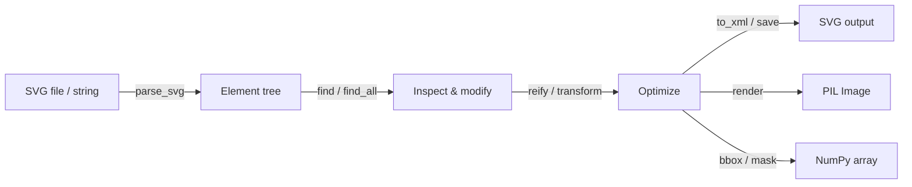

# Overview

## What is svglab?

svglab is a Python library for working with Scalable Vector Graphics (SVG). It lets you **parse** existing SVG files into a structured object model, **manipulate** them using familiar Python idioms, and **write** them back &mdash; with full control over formatting and optimization.

Unlike general-purpose XML libraries, svglab understands SVG: it knows that `<rect>` has a `width` attribute of type `Length`, that `<circle>` is a basic shape, and that `transform="rotate(45)"` is a rotation. Every element, attribute, and value has a proper Python type.

## Key capabilities

### Parsing &amp; serialization

Read SVG content from strings, files, byte streams, or `pathlib.Path` objects. Write it back with `.to_xml()` or `.save()`, optionally applying a `Formatter` with 20+ options for indentation, color format, number precision, path data style, and more.

→ [Parsing](user-guide/parsing.md) · [Serialization](user-guide/serialization.md)

### Full SVG 1.1 coverage

The library models all **80 elements** and **295 attributes** from the SVG 1.1 specification. Each element is a dedicated Python class with typed, validated attributes &mdash; no stringly-typed dictionaries.

→ [Elements](user-guide/elements.md) · [Attributes](user-guide/attributes.md)

### Type safety &amp; validation

Element classes are built on [Pydantic](https://docs.pydantic.dev/) models. Attributes are validated at assignment time, and your IDE can autocomplete attribute names and catch type errors before you run anything.

→ [Attributes: Validation](user-guide/attributes.md#validation)

### Transforms &amp; path data

svglab has first-class support for all six SVG affine transforms (`translate`, `rotate`, `scale`, `skewX`, `skewY`, `matrix`) and the full SVG path command set. Compose transforms, apply them to points or paths, or **reify** them &mdash; baking the transform directly into an element's geometry.

→ [Transforms](user-guide/transforms.md) · [Path Data](user-guide/path-data.md)

### Rendering &amp; analysis

Rasterize any element to a PIL `Image` via [resvg](https://github.com/baseplate-admin/resvg-py), compute geometric or visible bounding boxes, and extract pixel masks &mdash; all without leaving Python.

→ [Graphical Operations](user-guide/graphics.md)

### Optimization

Reduce SVG file size while preserving visual fidelity: lower floating-point precision, convert absolute coordinates to relative, shorten color values, use shorthand path commands, and more. The `Formatter` can be configured with options that bundle the most common optimization techniques.

→ [Serialization: Predefined formatters](user-guide/serialization.md#predefined-formatters)

## Design philosophy

svglab is guided by a few core principles:

**Correctness first.**
The library is built directly from the SVG 1.1 specification. Every element, attribute, and category mapping comes from the spec, not from guesswork. Runtime validation catches malformed data before it becomes a silent rendering bug.

**Pythonic API.**
SVG elements behave like Python objects: attributes are properties, children are managed with `add_child()` / `find()` / `find_all()`, and the `==` operator performs deep structural comparison. If you know Python, you already know the API.

**Types everywhere.**
Every attribute has a real type &mdash; `Length`, `Color`, `Angle`, `PathData`, `Transform`, and so on &mdash; not strings. This means IDE autocompletion, refactoring support, and static analysis work out of the box.

**Round-trip fidelity.**
Parsing an SVG and writing it back should not lose information. Unknown elements become `UnknownElement`, non-standard attributes are stored as `extra_attrs`, and comments and CDATA sections are preserved.

**Composable formatting.**
Serialization is separated from the object model. A `Formatter` configures output style independently, and can be swapped, nested, or used as a context manager without touching the data.

## Architecture at a glance

The central data structure is the **element tree** &mdash; a hierarchy of typed element objects (like `Svg`, `G`, `Rect`, `Path`) that mirrors the XML document. Every operation reads from or writes to this tree.

## Roadmap

svglab is under active development. Here's what's on the horizon:

- [x] Full SVG 1.1 element and attribute coverage
- [x] Affine transform composition and reification
- [x] Configurable formatter with 20+ options
- [x] Rendering via resvg
- [x] Bounding box and mask computation
- [ ] SVG 2 attribute support (partial today)
- [ ] Higher-level optimization passes (merge paths, remove hidden elements, collapse groups)
- [ ] CSS style computation and inlining
- [ ] Font metrics and text layout analysis
- [ ] WASM build for browser-based usage

!!! info "Contributing"
    Contributions are welcome! Check the [GitHub repository](https://github.com/reznakt/svglab) for open issues and contribution guidelines.

## Next steps

- [Installation](getting-started/installation.md) &mdash; install the library
- [Quickstart](getting-started/quickstart.md) &mdash; parse, modify, and save your first SVG
- [User Guide](user-guide/elements.md) &mdash; deep-dive into every feature
- [API Reference](api-reference/elements.md) &mdash; complete class and method documentation
