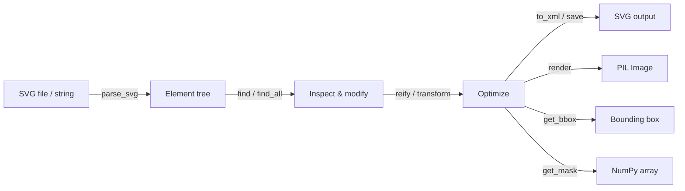

# Overview

## What is svglab?

svglab is a Python library for working with Scalable Vector Graphics (SVG). It lets you **parse** existing SVG files into a structured object model, **manipulate** them using familiar Python idioms, and **write** them back &mdash; with full control over formatting and optimization.

Unlike general-purpose XML libraries, svglab understands SVG: it knows that `<rect>` has a `width` attribute of type `Length`, that `<circle>` is a basic shape, and that `transform="rotate(45)"` is a rotation. Every element, attribute, and value has a proper Python type.

## Key capabilities

-   :material-swap-horizontal:{ .lg .middle } __Parsing &amp; serialization__

    ---

    Read SVG content from strings, files, byte streams, or `pathlib.Path` objects. Write it back with `.to_xml()` or `.save()`, optionally applying a `Formatter` with 24 options for indentation, color format, number precision, path data style, and more.

    [:octicons-arrow-right-24: Parsing](user-guide/parsing.md) &middot; [Serialization](user-guide/serialization.md)

-   :material-format-list-checks:{ .lg .middle } __Full SVG 1.1 coverage__

    ---

    All **80 elements** and **276 attributes** from the SVG 1.1 specification. Each element is a dedicated Python class with typed, validated attributes &mdash; no stringly-typed dictionaries.

    [:octicons-arrow-right-24: Elements](user-guide/elements.md) &middot; [Attributes](user-guide/attributes.md)

-   :material-shield-check:{ .lg .middle } __Type safety &amp; validation__

    ---

    Element classes are built on [Pydantic](https://docs.pydantic.dev/) models. Attributes are validated at assignment time, and your editor can autocomplete attribute names and catch type errors before you run anything.

    [:octicons-arrow-right-24: Validation](user-guide/attributes.md#validation)

-   :material-axis-arrow:{ .lg .middle } __Transforms &amp; path data__

    ---

    First-class support for all six SVG affine transforms (`translate`, `rotate`, `scale`, `skewX`, `skewY`, `matrix`) and the full path command set. Compose them, apply them to points or paths, or **reify** them into an element's geometry.

    [:octicons-arrow-right-24: Transforms](user-guide/transforms.md) &middot; [Path Data](user-guide/path-data.md)

-   :material-image-outline:{ .lg .middle } __Rendering &amp; analysis__

    ---

    Rasterize a document to a PIL `Image` via [resvg](https://github.com/baseplate-admin/resvg-py), measure any element's bounding box &mdash; on its own or as it contributes to the page &mdash; and extract pixel masks.

    [:octicons-arrow-right-24: Graphical Operations](user-guide/graphics.md)

-   :material-arrow-collapse:{ .lg .middle } __Optimization__

    ---

    Shrink files without changing how they look: lower floating-point precision, switch coordinates to relative, shorten colors, use shorthand path commands.

    [:octicons-arrow-right-24: Predefined formatters](user-guide/serialization.md#predefined-formatters)

## Design philosophy

svglab is guided by a few core principles:

**Correctness first.**
The library is built directly from the SVG 1.1 specification. Every element, attribute, and category mapping comes from the spec, not from guesswork. Runtime validation catches malformed data before it becomes a silent rendering bug.

**Pythonic API.**
SVG elements behave like Python objects: attributes are properties, children are managed with `add_child()` / `find()` / `find_all()`, and the `==` operator performs deep structural comparison. If you know Python, you already know the API.

**Types everywhere.**
Every attribute has a real type &mdash; `Length`, `Color`, `Angle`, `PathData`, `Transform`, and so on &mdash; not strings. This means IDE autocompletion, refactoring support, and static analysis work out of the box.

**Round-trip fidelity.**
Parsing an SVG and writing it back should not lose information. Unknown elements become `UnknownElement`, non-standard attributes are stored as `extra_attrs`, and comments and CDATA sections are preserved.

**Composable formatting.**
Serialization is separated from the object model. A `Formatter` configures output style independently, and can be swapped, nested, or used as a context manager without touching the data.

## Architecture at a glance

```mermaid
graph LR
    A["SVG file / string"] -->|parse_svg| B["Element tree"]
    B -->|find / find_all| C["Inspect & modify"]
    C -->|reify / transform| D["Optimize"]
    D -->|to_xml / save| E["SVG output"]
    D -->|render| F["PIL Image"]
    D -->|get_bbox| G["Bounding box"]
    D -->|get_mask| H["NumPy array"]
```

/// caption
Every operation reads from or writes to the element tree in the middle.
///

The central data structure is the **element tree** &mdash; a hierarchy of typed element objects (like `Svg`, `G`, `Rect`, `Path`) that mirrors the XML document. Every operation reads from or writes to this tree.

## Roadmap

svglab is under active development. Here's what's on the horizon:

- [x] Full SVG 1.1 element and attribute coverage
- [x] Affine transform composition and reification
- [x] Configurable formatter with 20+ options
- [x] Rendering via resvg
- [x] Bounding box and mask computation
- [ ] SVG 2 attribute support (partial today)
- [ ] Higher-level optimization passes (merge paths, remove hidden elements, collapse groups)
- [ ] CSS style computation and inlining
- [ ] Font metrics and text layout analysis
- [ ] WASM build for browser-based usage

!!! info "Contributing"
    Contributions are welcome! Check the [GitHub repository](https://github.com/reznakt/svglab) for open issues and contribution guidelines.

## Next steps

-   __[Installation](getting-started/installation.md)__ &mdash; install the library
-   __[Quickstart](getting-started/quickstart.md)__ &mdash; parse, modify, and save your first SVG
-   __[User Guide](user-guide/elements.md)__ &mdash; deep-dive into every feature
-   __[API Reference](api-reference/index.md)__ &mdash; complete class and method documentation

