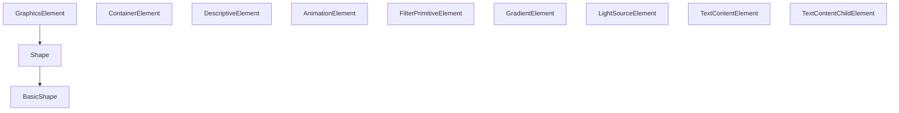

# Traits

The SVG specification groups its 80 elements into **categories** &mdash; graphics elements, basic shapes, containers, and so on. <span style="font-variant: small-caps;">svglab</span> represents these categories as **traits**: abstract base classes that tell you *what an element can do*, not just what it is.

## Why traits?

Consider rendering. Not every SVG element can be rendered &mdash; a `<defs>` block defines reusable content but doesn't draw anything by itself. Traits let <span style="font-variant: small-caps;">svglab</span> express this cleanly: only elements that implement `GraphicsElement` support operations like computing a bounding box.

You can also use traits for runtime type checking, which is more robust than checking a list of tag names:

```python
from svglab import Circle, GraphicsElement

circle = Circle(...)
isinstance(circle, GraphicsElement)  # True
```

## The trait hierarchy



The most important traits are described below. For the complete hierarchy with every method signature, see the [API Reference: Traits](../api-reference/traits.md).

## Graphics elements

`GraphicsElement` is the broadest category of "things that produce visual output". This includes shapes, text, images, and the `<use>` element. Any element with this trait can be:

- [Rendered to a raster image](graphics.md#rendering)
- [Queried for its bounding box](graphics.md#bounding-boxes)
- [Masked](graphics.md#masks)

## Shapes and basic shapes

### `Shape`

A `Shape` is a `GraphicsElement` whose geometry is defined by path data &mdash; either directly (like `<path>`) or indirectly (like `<rect>` or `<circle>`). Every shape has a `.to_path_data()` method that returns its geometry as a `PathData` object.

### `BasicShape`

`BasicShape` narrows things further to the six SVG primitives: `Rect`, `Circle`, `Ellipse`, `Line`, `Polyline`, and `Polygon`. In addition to `.to_path_data()`, basic shapes support `.to_path()`, which converts the element itself into a `Path` element:

```python
from svglab import Rect, Length

rect = Rect(x=Length(10), y=Length(20), width=Length(100), height=Length(50))
path = rect.to_path()   # Path element with equivalent geometry
```

This is useful for [optimization and normalization](graphics.md) &mdash; paths are a universal representation that many operations can work with.

!!! tip "When to convert shapes to paths"
    Converting to paths is a one-way simplification: you lose the semantic meaning (it's no longer obviously a rectangle), but you gain a uniform representation that's easier to transform and optimize. SVG optimizers commonly do this.

!!! info "Presentation attributes are preserved"
    `.to_path()` copies all shared attributes &mdash; `fill`, `stroke`, `opacity`, `id`, `class_`, `transform`, and so on &mdash; to the new `Path` element. Only shape-specific geometry attributes (like `cx`, `cy`, `r`) are dropped, since the geometry is now encoded in the path's `d` attribute.

## Container elements

`ContainerElement` covers elements that hold child elements: `Svg`, `G`, `Defs`, `Symbol`, `Marker`, `ClipPath`, `Mask`, and `Pattern`. These elements define coordinate spaces and can apply [transforms](transforms.md) or styles to all their children at once.

## Other traits

| Trait | Covers | Purpose |
|-------|--------|---------|
| `DescriptiveElement` | `Title`, `Desc`, `Metadata` | Metadata and accessibility |
| `AnimationElement` | `Animate`, `AnimateMotion`, `AnimateTransform`, `Set` | SMIL animations |
| `FilterPrimitiveElement` | `FeGaussianBlur`, `FeColorMatrix`, &hellip; | SVG filter effects |
| `GradientElement` | `LinearGradient`, `RadialGradient` | Color gradients |
| `LightSourceElement` | `FeDistantLight`, `FePointLight`, `FeSpotLight` | Lighting for filter effects |
| `TextContentElement` | `Text`, `Tspan`, `TextPath`, &hellip; | Text layout |
| `TextContentChildElement` | `Tspan`, `TextPath`, `AltGlyph`, `Tref` | Children of text elements |

## Using traits with `isinstance`

Traits are regular Python classes, so `isinstance()` checks work as expected. This is handy when processing a tree of elements and you need to branch on capability:

```python
from svglab import BasicShape, ContainerElement

for element in svg.find_all():
    if isinstance(element, BasicShape):
        path = element.to_path()
        # ... work with the path
    elif isinstance(element, ContainerElement):
        # ... recurse into children
```

!!! tip "Using traits with `find()`"
    You can also pass traits to `find()` and `find_all()` to match any element in a category:

    ```python
    from svglab import GraphicsElement

    # Find the first element that produces visual output
    gfx = svg.find(GraphicsElement)
    ```

    This is more flexible than searching for a specific element type when you care about capabilities rather than tag names.

## Next steps

- [Elements](elements.md) &mdash; the full element catalogue
- [Path Data](path-data.md) &mdash; working with `.to_path_data()` results
- [Graphical Operations](graphics.md) &mdash; rendering, bounding boxes, and masks
- [API Reference: Traits](../api-reference/traits.md) &mdash; complete trait documentation
