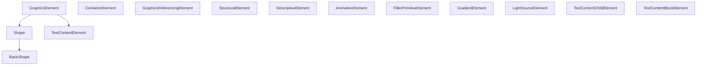

# Traits

The SVG specification groups its 80 elements into **categories** &mdash; graphics elements, basic shapes, containers, and so on. <span class="svglab">svglab</span> represents these categories as **traits**: abstract base classes that tell you *what an element can do*, not just what it is.

## Why traits?

Consider converting a shape to a path. `<rect>` and `<circle>` can be rewritten as a `<path>` with equivalent geometry; `<defs>` and `<filter>` cannot, because they don't describe geometry at all. Traits let <span class="svglab">svglab</span> express this cleanly: `.to_path()` exists on `BasicShape` and nowhere else, so the elements that can't do it don't advertise a method that would fail.

You can also use traits for runtime type checking, which is more robust than checking a list of tag names:

```python
from svglab import Circle, GraphicsElement

circle = Circle(...)
isinstance(circle, GraphicsElement)  # True
```

## The trait hierarchy


```mermaid
graph TD
    GraphicsElement --> Shape
    GraphicsElement --> TextContentElement
    Shape --> BasicShape
    ContainerElement
    GraphicsReferencingElement
    StructuralElement
    DescriptiveElement
    AnimationElement
    FilterPrimitiveElement
    GradientElement
    LightSourceElement
    TextContentChildElement
    TextContentBlockElement
```

/// caption
Traits that inherit from another trait are shown connected; the rest derive directly from `Element`.
///

The most important traits are described below. For the complete hierarchy with every method signature, see the [API Reference: Traits](../api-reference/index.md).

## Graphics elements

`GraphicsElement` is the broadest category of "things that produce visual output". This includes shapes, text, images, and the `<use>` element. Any element with this trait can be:

- [Queried for its bounding box](graphics.md#bounding-boxes)
- [Turned into a pixel mask](graphics.md#masks)

`ContainerElement` grants those same two operations, so groups and other containers can be measured as well. [Rendering](graphics.md#rendering) is different: `.render()` lives on `Svg` alone, because rasterizing needs a complete document with its own dimensions.

## Shapes and basic shapes

### `Shape`

A `Shape` is a `GraphicsElement` whose geometry is defined by straight lines and curves &mdash; either directly (like `<path>`) or indirectly (like `<rect>` or `<circle>`). What every shape gets from this trait is `pathLength` and the `.set_path_length()` method, which rescales `stroke-dasharray` and `stroke-dashoffset` so the dash pattern keeps its appearance.

### `BasicShape`

`BasicShape` narrows things further to the six SVG primitives: `Rect`, `Circle`, `Ellipse`, `Line`, `Polyline`, and `Polygon`. These are the elements that can be rewritten as paths, via `.to_path_data()` for the raw geometry and `.to_path()` for a complete replacement element:

```python
from svglab import Rect, Length

rect = Rect(
    x=Length(10), y=Length(20), width=Length(100), height=Length(50)
)
path = rect.to_path()  # Path element with equivalent geometry
```

!!! svglab "`Path` is not a `BasicShape`"
    `Path` is a `Shape` but not a `BasicShape`, so it has neither method &mdash; its geometry is already path data, available as `path.d`.

This is useful for [optimization and normalization](graphics.md) &mdash; paths are a universal representation that many operations can work with.

!!! tip "When to convert shapes to paths"
    Converting to paths is a one-way simplification: you lose the semantic meaning (it's no longer obviously a rectangle), but you gain a uniform representation that's easier to transform and optimize. SVG optimizers commonly do this.

!!! info "Presentation attributes are preserved"
    `.to_path()` copies all shared attributes &mdash; `fill`, `stroke`, `opacity`, `id`, `class_`, `transform`, and so on &mdash; to the new `Path` element. Only shape-specific geometry attributes (like `cx`, `cy`, `r`) are dropped, since the geometry is now encoded in the path's `d` attribute.

## Container elements

`ContainerElement` covers the eleven elements the specification lists as containers: `Svg`, `G`, `A`, `Defs`, `Switch`, `Symbol`, `Marker`, `Mask`, `Pattern`, `Glyph`, and `MissingGlyph`. These elements define coordinate spaces and can apply [transforms](transforms.md) or styles to all their children at once.

!!! note
    `ClipPath` is *not* a container element in the SVG sense, even though it has children &mdash; it defines a clipping region rather than a rendered coordinate space.

## Other traits

| Trait | Covers | Purpose |
|-------|--------|---------|
| [`DescriptiveElement`](../api-reference/traits/DescriptiveElement.md) | `Title`, `Desc`, `Metadata` | Metadata and accessibility |
| [`AnimationElement`](../api-reference/traits/AnimationElement.md) | `Animate`, `AnimateColor`, `AnimateMotion`, `AnimateTransform`, `Set` | SMIL animations |
| [`FilterPrimitiveElement`](../api-reference/traits/FilterPrimitiveElement.md) | `FeGaussianBlur`, `FeColorMatrix`, &hellip; | SVG filter effects |
| [`GradientElement`](../api-reference/traits/GradientElement.md) | `LinearGradient`, `RadialGradient` | Color gradients |
| [`LightSourceElement`](../api-reference/traits/LightSourceElement.md) | `FeDistantLight`, `FePointLight`, `FeSpotLight` | Lighting for filter effects |
| [`TextContentElement`](../api-reference/traits/TextContentElement.md) | `Text`, `Tspan`, `TextPath`, &hellip; | Text layout |
| [`TextContentChildElement`](../api-reference/traits/TextContentChildElement.md) | `Tspan`, `TextPath`, `AltGlyph`, `Tref` | Children of text elements |
| [`StructuralElement`](../api-reference/traits/StructuralElement.md) | `Svg`, `G`, `Defs`, `Symbol`, `Use` | Document structure |
| [`GraphicsReferencingElement`](../api-reference/traits/GraphicsReferencingElement.md) | `Use`, `Image` | Graphics pulled in by reference |

## Using traits with `isinstance`

Traits are regular Python classes, so `isinstance()` checks work as expected. This is handy when processing a tree of elements and you need to branch on capability:

```python
from svglab import BasicShape, ContainerElement

for element in svg.find_all():
    if isinstance(element, BasicShape):
        path = element.to_path()
        # ... work with the path
    elif isinstance(element, ContainerElement):
        # ... recurse into children
```

!!! tip "Using traits with `find()`"
    You can also pass traits to `find()` and `find_all()` to match any element in a category:

    ```python
    from svglab import GraphicsElement

    # Find the first element that produces visual output
    gfx = svg.find(GraphicsElement)
    ```

    This is more flexible than searching for a specific element type when you care about capabilities rather than tag names.

## Next steps

<div class="grid cards" markdown>

-   __[Elements](elements.md)__ &mdash; the full element catalogue
-   __[Path Data](path-data.md)__ &mdash; working with `.to_path_data()` results
-   __[Graphical Operations](graphics.md)__ &mdash; rendering, bounding boxes, and masks
-   __[API Reference: Traits](../api-reference/index.md)__ &mdash; complete trait documentation

</div>
